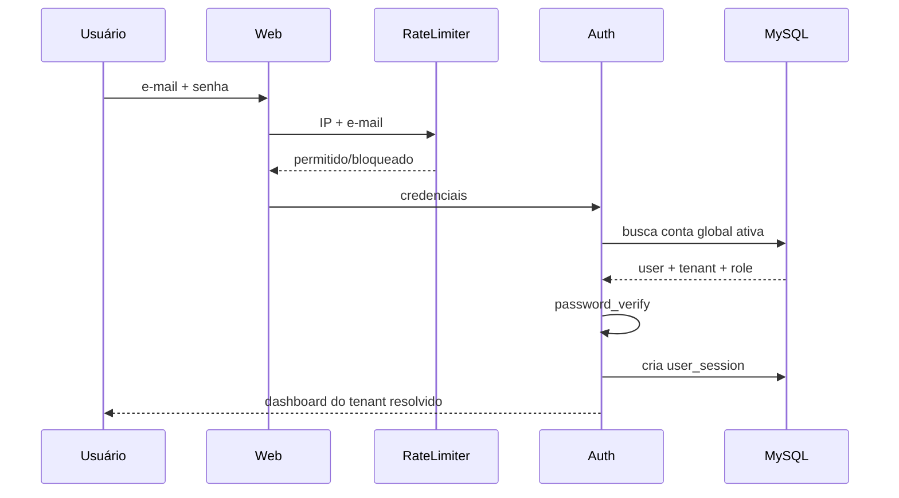
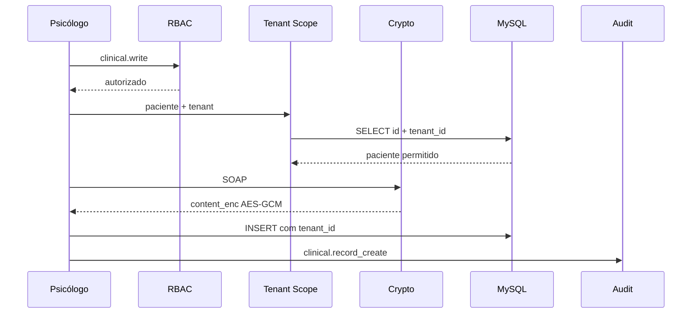

# Fluxo de Dados

## Login


## Prontuário


## IA
```text
Nota clínica
  ↓
PII Sanitizer local
  ↓
RAG interno por tenant/global oficial
  ↓
API externa (somente quando AI_ENABLED)
  ↓
Resposta assistiva
  ↓
Revisão humana
  ↓
Persistência cifrada da resposta quando aplicável
```
